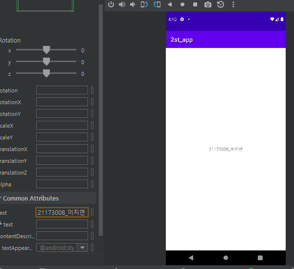
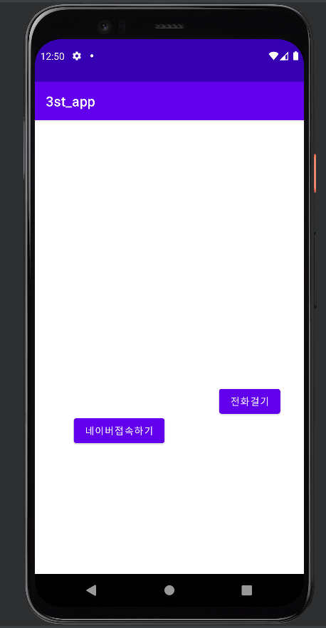

# 2주차(2022-03-15)
- 안드로이드스튜디오 & Github 가입 및 레포지토리 만듬
</img>

# 3주차(2022-03-22)
</img>
</img>
</img>

# 4주차(2022-03-29)
</img>

# 5주차(2022-04-05)
</img>
</img>
</img>
</img>

# 6주차(2022-04-12)
</img>
</img>

# 10주차(2022-05-10)
-오늘 배운 내용 중 여러 화면 만들고 화면 간 전환하기
</img>
</img>
</img>
</img>

